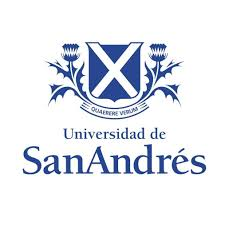

<table>
  <tr>
    <td>
      
    </td>
    <td>
      <h1>Final Project: TurtleBot3 SLAM and Localization</h1>
      <p><strong>Principles of Autonomous Robotics</strong> · University of San Andres (Argentina)</p>
    </td>
  </tr>
</table>

This repository presents a robotics project developed by **Matias** and **Bruno Castanigno Rossi** as the final assignment for the course **Principles of Autonomous Robotics** at the **University of San Andres, Argentina**.

The project focuses on autonomous mapping and localization in a maze environment using TurtleBot3 and ROS 2.

## What We Built

We developed and integrated two main workflows:

- **Part A - Custom Python SLAM pipeline**
- **Part B - AMCL-style localization and navigation scaffold**

Both parts run in simulation and are designed to visualize and validate key autonomous robotics concepts end-to-end.

## Core Tools and Technologies

The most relevant tools and components used in this project are:

- **ROS 2 (Python / `rclpy`)** for modular robot software architecture.
- **Gazebo + TurtleBot3** for realistic robot simulation in a maze world.
- **RViz2** for real-time visualization of maps, poses, and particle clouds.
- **Particle Filter techniques** for pose hypothesis tracking.
- **Occupancy Grid Mapping** with **log-odds updates**.
- **LiDAR processing (`sensor_msgs/LaserScan`)** for environment perception.
- **Bresenham ray tracing** for free/occupied cell updates along laser beams.
- **TF2 transforms** (`map`, `odom`, `base_footprint`) for frame consistency.
- **Nav2 map server/lifecycle components** for localization-side map management.

## Project Structure

- `archivos_parteA/`
  - Maze simulation assets.
  - `turtlebot3_slam_mapper/`: Python SLAM package and launch files.
- `my_py_amcl/`
  - AMCL-oriented localization package, map assets, RViz config, and launch setup.
- `PRA_TPFinal_A.pdf`
- `PRA_TPFinal_B.pdf`
  - Documentation delivered with the final project.

## Main Nodes

### Part A - `python_slam_node`

Implemented flow:

1. Read odometry and LiDAR scans.
2. Propagate particles with motion uncertainty.
3. Compute particle weights from map/scan consistency.
4. Resample particles.
5. Update occupancy maps with log-odds.
6. Publish occupancy map and `map -> odom` transform.

Launch file:

- `archivos_parteA/turtlebot3_slam_mapper/launch/python_slam_maze.launch.py`

### Part B - `amcl_node`

Implemented base architecture:

- Map, scan, initial pose, and goal subscriptions.
- Particle cloud handling and visualization outputs.
- State-machine scaffolding (`IDLE`, `PLANNING`, `NAVIGATING`, `AVOIDING_OBSTACLE`).
- TF interfaces and localization pipeline structure for AMCL-style operation.

Launch file:

- `my_py_amcl/launch/amcl_maze.launch.py`

## How to Run

From your ROS 2 workspace:

```bash
colcon build --symlink-install
source install/setup.bash
export TURTLEBOT3_MODEL=burger
```

Run Part A:

```bash
ros2 launch turtlebot3_slam_mapper python_slam_maze.launch.py
```

Run Part B:

```bash
ros2 launch my_py_amcl amcl_maze.launch.py
```

## Authors

- Matias
- Bruno Castanigno Rossi

---

If the logo does not render, place the university image as `image.png` in the repository root.
